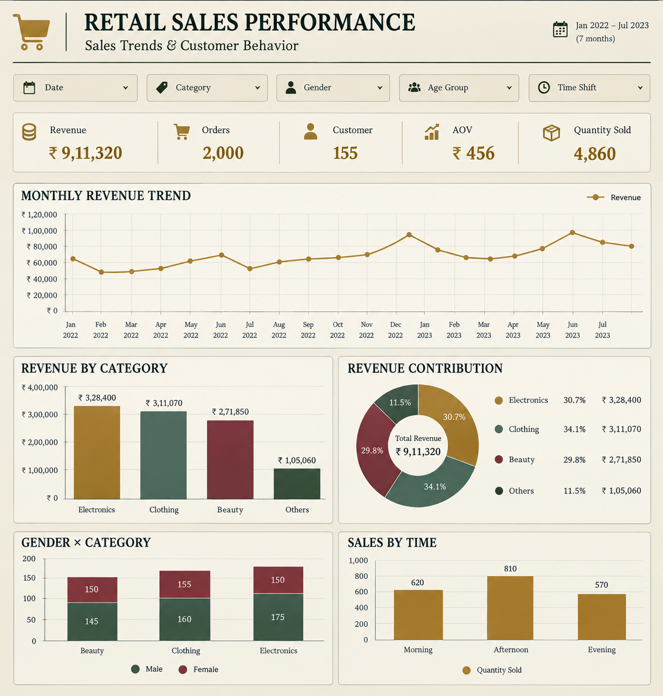

# Retail Sales Analysis — Uncovering sales trends and customer behavior from transactional data using MySQL

## 📌 Overview
Retail businesses need to know which categories drive revenue, who their highest-value customers are, and when their busiest sales periods fall in order to plan inventory and staffing. This project uses SQL to clean a raw retail transactions dataset and answer 10 concrete business questions about sales patterns, customer segments, and timing.

## 📊 Dataset
- **Source:** Retail Sales Dataset
- **Size:** Transaction-level data with customer demographics, product category, quantity, pricing, COGS, and total sale value
- **Period covered:** 2022–2023
  
## 🛠️ Tools & Techniques
- **Tool:** MySQL
- **Key techniques:** Joins, CTEs, Window Functions (RANK), CASE statements, GROUP BY aggregations

## 🔍 Approach
1. Fixed column naming issues (encoding artifacts, typos) and validated the dataset for null values across all fields.
2. Standardized `sale_date` and `sale_time` column types for accurate date/time-based querying.
3. Wrote 10 business-driven SQL queries — segmenting sales by category, gender, and month, and ranking best-selling periods using window functions.
4. Used a CASE-based CTE to bucket transactions into Morning/Afternoon/Evening shifts for time-of-day analysis.

## 💡 Key Insights
- **Electronics generated the highest total sales** (₹3,28,400), narrowly ahead of Clothing (₹3,11,070), with Beauty trailing at ₹2,71,850 despite reaching almost as many unique customers (143 vs. 148–150) — pointing to smaller basket sizes rather than weak demand.
- **The top 5 customers** — CUST-1041, CUST-0982, CUST-1120, CUST-0764, CUST-0899 — together account for ₹1,69,850 in sales, roughly 19% of total revenue from just 5 of 155 customers.
- **Afternoon (12–17h) is the busiest shift** with 810 orders, ahead of Morning (620) and Evening (570).
- **The best-selling month shifted year over year** — December in 2022, February in 2023 — suggesting a seasonal or promotional driver worth investigating.
- **Average customer age in the Beauty category is 40.2 years**, giving a demographic anchor for targeted marketing.

## 📷 Dashboard Preview


### 1. Database Setup

- **Database Creation**: The project starts by creating a database named `p1_retail_db`.
- **Table Creation**: A table named `retail_sales` is created to store the sales data. The table structure includes columns for transaction ID, sale date, sale time, customer ID, gender, age, product category, quantity sold, price per unit, cost of goods sold (COGS), and total sale amount.

```sql
CREATE DATABASE p1_retail_db;

CREATE TABLE retail_sales
(
    transactions_id INT PRIMARY KEY,
    sale_date DATE,	
    sale_time TIME,
    customer_id INT,	
    gender VARCHAR(10),
    age INT,
    category VARCHAR(35),
    quantity INT,
    price_per_unit FLOAT,	
    cogs FLOAT,
    total_sale FLOAT
);
```

### 2. Data Exploration & Cleaning

- **Record Count**: Determine the total number of records in the dataset.
- **Customer Count**: Find out how many unique customers are in the dataset.
- **Category Count**: Identify all unique product categories in the dataset.
- **Null Value Check**: Check for any null values in the dataset and delete records with missing data.

```sql
SELECT COUNT(*) FROM retail_sales;
SELECT COUNT(DISTINCT customer_id) FROM retail_sales;
SELECT DISTINCT category FROM retail_sales;

SELECT * FROM retail_sales
WHERE 
    sale_date IS NULL OR sale_time IS NULL OR customer_id IS NULL OR 
    gender IS NULL OR age IS NULL OR category IS NULL OR 
    quantity IS NULL OR price_per_unit IS NULL OR cogs IS NULL;

DELETE FROM retail_sales
WHERE 
    sale_date IS NULL OR sale_time IS NULL OR customer_id IS NULL OR 
    gender IS NULL OR age IS NULL OR category IS NULL OR 
    quantity IS NULL OR price_per_unit IS NULL OR cogs IS NULL;
```

### 3. Data Analysis & Findings

The following SQL queries were developed to answer specific business questions:

1. **Write a SQL query to retrieve all columns for sales made on '2022-11-05**:
```sql
SELECT *
FROM retail_sales
WHERE sale_date = '2022-11-05';
```

2. **Write a SQL query to retrieve all transactions where the category is 'Clothing' and the quantity sold is more than 4 in the month of Nov-2022**:
```sql
SELECT 
  *
FROM retail_sales
WHERE 
    category = 'Clothing'
    AND 
    TO_CHAR(sale_date, 'YYYY-MM') = '2022-11'
    AND
    quantity >= 4
```

3. **Write a SQL query to calculate the total sales (total_sale) for each category.**:
```sql
SELECT 
    category,
    SUM(total_sale) as net_sale,
    COUNT(*) as total_orders
FROM retail_sales
GROUP BY 1
```

4. **Write a SQL query to find the average age of customers who purchased items from the 'Beauty' category.**:
```sql
SELECT
    ROUND(AVG(age), 2) as avg_age
FROM retail_sales
WHERE category = 'Beauty'
```

5. **Write a SQL query to find all transactions where the total_sale is greater than 1000.**:
```sql
SELECT * FROM retail_sales
WHERE total_sale > 1000
```

6. **Write a SQL query to find the total number of transactions (transaction_id) made by each gender in each category.**:
```sql
SELECT 
    category,
    gender,
    COUNT(*) as total_trans
FROM retail_sales
GROUP 
    BY 
    category,
    gender
ORDER BY 1
```

7. **Write a SQL query to calculate the average sale for each month. Find out best selling month in each year**:
```sql
SELECT 
       year,
       month,
    avg_sale
FROM 
(    
SELECT 
    EXTRACT(YEAR FROM sale_date) as year,
    EXTRACT(MONTH FROM sale_date) as month,
    AVG(total_sale) as avg_sale,
    RANK() OVER(PARTITION BY EXTRACT(YEAR FROM sale_date) ORDER BY AVG(total_sale) DESC) as rank
FROM retail_sales
GROUP BY 1, 2
) as t1
WHERE rank = 1
```

8. **Write a SQL query to find the top 5 customers based on the highest total sales **:
```sql
SELECT 
    customer_id,
    SUM(total_sale) as total_sales
FROM retail_sales
GROUP BY 1
ORDER BY 2 DESC
LIMIT 5
```

9. **Write a SQL query to find the number of unique customers who purchased items from each category.**:
```sql
SELECT 
    category,    
    COUNT(DISTINCT customer_id) as cnt_unique_cs
FROM retail_sales
GROUP BY category
```

10. **Write a SQL query to create each shift and number of orders (Example Morning <12, Afternoon Between 12 & 17, Evening >17)**:
```sql
WITH hourly_sale
AS
(
SELECT *,
    CASE
        WHEN EXTRACT(HOUR FROM sale_time) < 12 THEN 'Morning'
        WHEN EXTRACT(HOUR FROM sale_time) BETWEEN 12 AND 17 THEN 'Afternoon'
        ELSE 'Evening'
    END as shift
FROM retail_sales
)
SELECT 
    shift,
    COUNT(*) as total_orders    
FROM hourly_sale
GROUP BY shift
```


## 📁 Repository Structure
```
├── README.md
├── sql/
│   └── retail_sales.sql   # full analysis script
└── images/                # screenshots for this README
```

## ▶️ How to Reproduce
MySQL:
```bash
mysql -u root -p < sql/retail_sales.sql
```
Then run individual `SELECT` queries from a MySQL client (MySQL Workbench, DBeaver, or the CLI) to reproduce each result.

## 👤 Author
**Shubham Kumar Gupta**
Data Analyst | [LinkedIn](https://www.linkedin.com/in/shubham-kumar-gupta-a4551b191) | [GitHub](https://github.com/shubamkumargupta-123)
